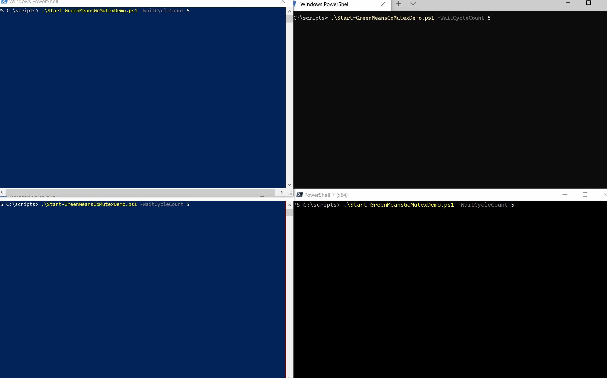
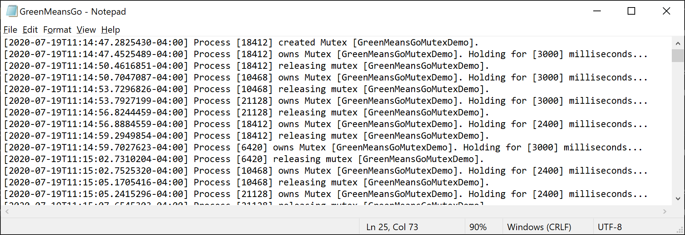

# Green Means Go - A (Visual) Mutex Demo

## What's a Mutex?

A Mutex is an operating system construct which allows processes to coordinate **Mut**ally **Ex**clusive access
to resources.  If it were a conversation between the OS and some processes it might sound a bit like this:

- Notepad: "I'd like exclusive access to write to file `C:\Temp\abc.txt`"
- OS: "It's all yours Notepad."
- VSCode: "I'd like exclusive access to write to file `C:\Temp\abc.txt`"
- OS: "Sit tight VSCode.  It's being used by someone else."
- VSCode: "Okay - let me know when it's ready."
- OS: "Will do."
- Notepad: "I'm done with file `C:\Temp\abc.txt`"
- OS: "VSCode? File `C:\Temp\abc.txt` is all yours."
- VSCode: "Thanks!"

## Why do I care?

More than likely you don't. But, if your script does some Asynchronous-Fu (think [Jobs](https://docs.microsoft.com/en-us/powershell/module/microsoft.powershell.core/about/about_jobs?view=powershell-7) or [ThreadJobs](https://docs.microsoft.com/en-us/powershell/module/microsoft.powershell.core/about/about_thread_jobs?view=powershell-7)) and those
worker-jobs share a log file you're gonna **need** a mutex.  Otherwise those little jobs will be stepping
on each other - log entries will be missed...exceptions will be thrown...crying and nashing
of teeth sort-of-thing.

## Okay, I'm still here.  How do I use a Mutex in PowerShell?

Because PowerShell is sitting right on top of .NET we can leverage the [System.Threading.Mutex](https://docs.microsoft.com/en-us/dotnet/api/system.threading.mutex?view=netcore-3.1) class.  With that
we can create a Mutex object in PowerShell:

```powershell
$mutex = New-Object System.Threading.Mutex($false, $Name, [ref] $createdMutex
```
and use the methods it provides to wait (`WaitOne`) for exclusive access to a resource and release (`ReleaseMutex`) access of that resource when we're done.

## Demo, please.

### The Setup

Each PowerShell console will run the same script.  For several passes (all for demo purposes) the script will request ownership of a named Mutex and if it gets ownership it will change the console color to Green, log a message (to a shared log file) and hang on to the ownership (by sleeping) for a (progressively shorter) period of time.  If the script does **not** get ownership of the Mutex (because it is owned by another) it will change the console color to Red and wait until ownership is granted.

### Watch a Mutex in action (<span style="color:green">Green</span> = Owner; <span style="color:red">Red</span> = Waiting for Ownership)



### The (Common) Log File



## Conclusion

A Mutex is locking mechanism that allows processes and threads to coordinate access to resources.  You might need it one day - especially if you have scripts that do multi-process (Jobs) or mult-threaded (ThreadJobs) work and require access to the same resource - like a log file.  Enjoy!